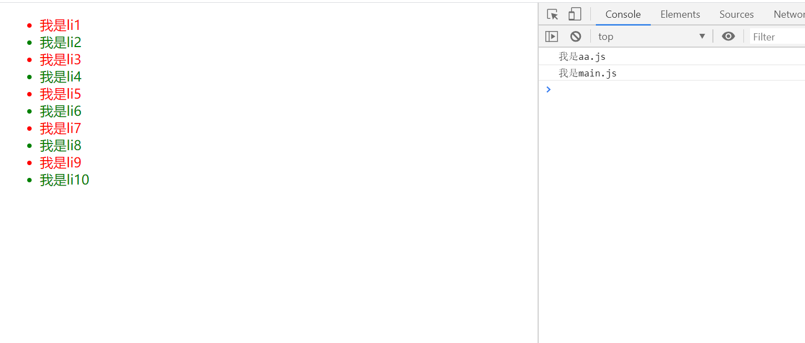

# webpack打包

## 1、webpack 基本配置

1、建立目录 dist、src/main.js

2、初始化

```bash
yarn init -y
```

3、安装依赖包

```bash
yarn add webpack webpack-cli -D
```

4、在package.json文件中，配置scripts，在此之前 需要创建 webpack.config.js 文件

```js
"scripts": {
    "build": "webpack --config webpack.config.js"
 },
```

5、webpack的基本配置

```js
const path = require("path") //node path

module.exports = {
    entry: "./src/main.js", //入口文件
    output: { //出口
        //打包存放路径，必须是 绝对路径
        path: path.join(__dirname, "dist"),
        //打包后，生成的文件名
        filename: "bundle.js"
    },
     //production：产品模式，去除注释，空格，换行
    //development：开发模式，保留注释，空格，换行
    mode: 'development'
}
```


## 2、基于webpack实现隔行变色

**2.1 所需依赖**

```bash
yarn add jquery
```

**2.2 在根目录下public文件夹下新建 index.html**

```html
<div id="app">
        <ul>
            <li>我是li1</li>
            <li>我是li2</li>
            <li>我是li3</li>
            <li>我是li4</li>
            <li>我是li5</li>
            <li>我是li6</li>
            <li>我是li7</li>
            <li>我是li8</li>
            <li>我是li9</li>
            <li>我是li10</li>
        </ul>
    </div>

    <script src="../dist/bundle.js"></script>
```


**2.2 在main.js 引入jQuery依赖**

```js
const $ = require('jquery');

$(function() {
    $("#app li:nth-child(odd)").css("color", "red")
    $("#app li:nth-child(even)").css("color", "green")
})
```

要想查看到最终的结果，必须要重新打包一次

**2.3 结果**



## 3、自动生成HTML文件，配置html-webpack-plugin插件

> 官网：https://www.webpackjs.com/plugins/html-webpack-plugin/

3.1 安装依赖

```bash
npm install --save-dev html-webpack-plugin
```

3.2 基本用法

```js
const HtmlWebpackPlugin = require('html-webpack-plugin');
 plugins: [
     new HtmlWebpackPlugin({
         template: "./public/index.html"
     })
 ]
```

配置好后，public目录下的index.html，无须引入打包后的js文件，该文件会自动被插件生成HTML文件引用


## 4、webpack中处理css文件

4.1 安装依赖

```bash
yarn add style-loader css-loader -D
```

4.2 配置

```

```


## 5. 分离CSS文件  

将css放到style标签中，请求次数减少了，但是如果css太大的话，写法也不符合规范，故此将css进行分离成单独的文件。

- webpack4：提供的插件是 min-css-extract-plugin
- webpack3：提供的插件是extract-text-webpack-plugin

